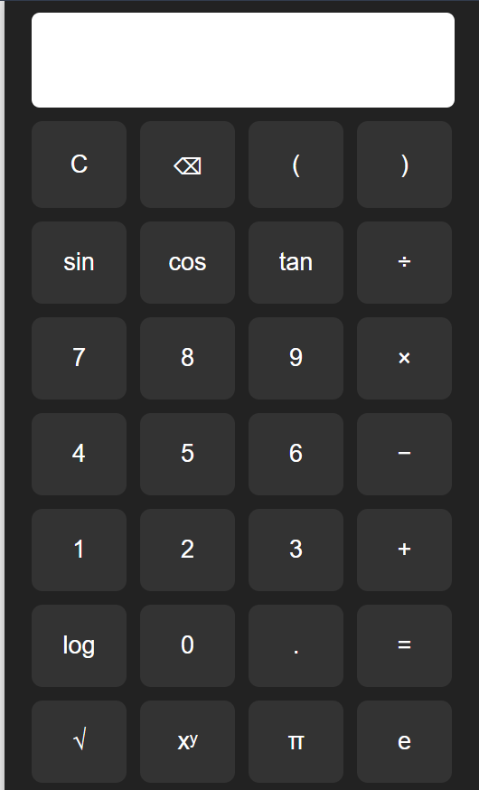

# 🔢 Scientific Calculator (HTML, CSS, JavaScript)

A modern web-based scientific calculator built using **HTML**, **CSS**, and **JavaScript**. It replicates the functionality of a traditional scientific calculator with a clean, responsive UI.

---

## 🚀 Features

- Basic operations: `+`, `−`, `×`, `÷`
- Scientific functions: `sin`, `cos`, `tan`, `log`, `√`
- Constants: π (pi), e (Euler's number)
- Power and parentheses: `^`, `()`
- Clear and Backspace

---

## 🖥️ Preview



---

## 📂 Files

- `index.html` – Main calculator layout and structure
- `style.css` – Styling with modern UI elements
- `script.js` – Functional logic for calculations and button handling

---

## ⚙️ How to Use

1. Clone the repository:
   ```bash
   git clone https://github.com/yourusername/scientific-calculator.git
   cd scientific-calculator

